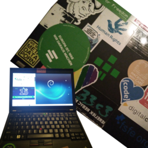

## Starting the internship

---

### 07.01.18 / 08.01.18
**Hello Berlin!**
I arrived yesterday, Sunday 7th, after an eleven hours long bus trip with barely any sleep and with just enough strength to get my bag up the 10th floor of my new dwelling. Nothing much happened afterwards, despite meeting my room mates for the first time and unpacking my stuff, as I arrived at 11PM.
Next day was off for me, so I slept until late morning and did some grocery shopping and preparing for the next day afterwards. Also, I checked out my surroundings and a few places of Berlin I haven't seen yet. Nothing worth mentioning, though. And there is still much more I want to see, experience and learn!

Back at home in Trier, I am part of a supranational youth group called [Junge Europäische Föderalisten](http://trier.jef-rlp.de/) (Young European Federalists). Since I can not attend our monthly meetings or any other activities, I was really keen on visiting the Berlin group of our organisation. So that's what I did on Monday evening: attending the "Jour-Fixe" of the [Junge Europäische Bewegung](http://jeb-bb.de/) (Young European Movement) Berlin/Brandenburg.
Their meeting was fairly different from what we do in Trier. Usually one of us prepares a quick summary of a current EU-political topic, which we then discuss for 1-2 hours. This is quite interesting, as exchanging and forming opinions is something that I feel like doesn't happen very often during our education. That is even if you study economics or political sciences... Surely you can find people online, that are willing to discuss, however civilized conversations are fairly rare in that case. Because of this (and because I never wanted to *decide* for a political party to join) I am really grateful for the monthly discussions in our Group. If you happen to live nearby and if you are as enthusiastic about the EU as we are, make sure to [say hello](https://jeftrier.wordpress.com/eu-um-8/)!

Anyways, unlike the JEF-Trier, the monthly meeting of the JEB-BB isn't about discussions, but more about getting to know each other. It was much less formal or organized and felt a bit more friendly (not that people of the JEF-Trier are unfriendly, but discussions usually evolve around facts and often times are objective. There isn't much room to get to know everyone sitting on that table).
In Berlin, they seem to have much more activities outside their monthly meeting than we have in Trier, though the "Jour-Fixe" is a great way to get in touch with them. I experienced the *JEB'ers* as very accommodating and friendly. I'll make sure to go there next month as well and will probably also attend other projects and meetings they do :)

---

### 09.01.18 / 10.01.18

Tuesday was my first official day as an intern at the [Free Software Foundation Europe](https://fsfe.org/). I came in the office at 8:30AM, I was shown around and given my own desk and notebook: A glorious **Lenovo X220**, plastered with FreeSoftware-stickers and ready to rock the distribution of my choice.
*Obviously*, I chose [Debian](https://www.debian.org/). As the FSFE currently shares their office in Berlin with the [KDE e.V.](https://ev.kde.org/), the desktop choice was a no-brainer as well...
In all honesty, the choice for KDE was out of lazyness. I only need a few tools for my work here and I'm good to go. For lunch, we went for japanese as this was my first day and Jonas (if you are familiar with the FSFE, you probably are with him as well) was here by accident as well. For the rest of the day, I did fairly boring office tasks and folded **hundreds** of donation receipts and "Thank You!" letters for donations that came in at the end of 2017.

On my second work day, we started off by giving me more access to the FSFE internal tools, like the Ticketsystem, Mailing lists, etc.
There were still a whole lot of donation receipts left, together with a whole lot of orders for [promotional material](https://fsfe.org/contribute/spreadtheword) that came in over the holidays. So again, there was a lot of "*busy-work*" and office tasks to be done for me. Nevertheless, they are very important to spread the word about free software, open standards and general information.
I really, really love some of their materials like the [I love Free Software stuff](https://fsfe.org/contribute/spreadtheword#ilovefs), as well as the [Email self-defence leafelets](http://download.fsfe.org/advocacy/promomaterial/Email-self-defense/gnupg-leaflet.en.pdf) or my favorite campaign: ["Public Money? Public Code!"](https://fsfe.org/contribute/spreadtheword#pmpc).
I will most likely be heavily involved into the latter one, but there is still nothing fixed. As an economics student who had specializations in political economy, this surely is one of the most interesting campaigns.

Also on that day was my first "Daily Meeting". That isn't as formal as it may sound, though. It just means, that everyone briefly explains what she/he has done on that day so far and what tasks need to be done next. This does indeed sound meaningless, but I feel like it is a very nice and friendly incentive to prevent slacking and get your work done and planned out. I really like it! And since the FSFE is spread around all over europe (and outside as well), this meeting usually happens via voice-chat :)

---

### 11.01.18 / 12.01.18

On Tuesday Max, who works on several FSFE-campaigns including the "I love FreeSoftware Day" and "Public Money? Public Code!" reached out to me regarding my involvement in these campaigns. So for a few hours I did research, brainstorming, preparations and a lot of notes. Afterwards, there were still more promo-orders to get out. Because of the holidays, there was quite some backlog which had to be completed ASAP!
In the afternoon, we had some "*farewell tea*" with Carmen, the FSFE's former intern.

On that evening, the administration of the city Barcelona [declared their plans to move their infrastructure to Free Software](https://elpais.com/ccaa/2017/12/01/catalunya/1512145439_132556.html). Within two years, they plan to replace Internet Explorer with [Firefox](http://firefox.com) *(who does still use IE?!*), MS Office with [LibreOffice](https://libreoffice.org/), MS Exchange with [Open-Xchange](https://www.open-xchange.com/) and in the end, MS Windows with [Ubuntu](https://ubuntu.com/). They had been testing this in a pilot-project before and hope to mitigate costs as well as loosen their independence from single companies. Barcelona also signed the FSFE's [Open letter in the PMPC Campaign](https://publiccode.eu/#action) as first administration world wide.
This brought quite the attention to our campaign over night. [PMPC](https://publiccode.eu) has been a huge success before this already, however the support of such a big official institution does have a very nice impact. And as the internet did it's thing, **we** on the other hand got flooded by orders for promotional material because of this - which is great! **Go out and spread the word!**

So for the entirety of my work time on friday, I did nothing but packaging and sending out promo-material...
When I came home in the evening, I started preparing my work-notebook's R-Environment, so I could have a go with some statistics-magic in the following week :)

---

### 13.01.18 / 14.01.18

Saturday started with sleeping until early noon :)
I originally planned to have a nice breakfast and a generally easy morning and go do some sight-seeing in the afternoon. *Oh, if I knew...*

Immediately during breakfast, when I was trying to access my [Newsfeed](https://www.jayvii.de/feeds/news.html) I realized, that both my sites, as well as all other selfhosted services were down. The issue with that is, that my homeserver is not with me, but hundreds of kilometers from here at my mother's house.
So, instead of going out, I spend the entire afternoon talking to my mother on the phone and explaining her, how to restart the box, de-encrypting the harddrive during boot and troubleshoot the issue. She was extremely patient and dedicated, which paid out eventually. After several hours, it finally worked and if you are currently reading this blog-post on my website, then it still does :)

Afterwards, I did some grocery shopping for the weekend and writing this blog/diary thing.

About the sight-seeing... I will most likely do that tomorrow - Or not. I will keep you updated!

**Have a nice weekend. Cheers!**

