## Wrecking Columbia Hall

### 22.01.18/23.01.18
The beginning of this week has been fairly unspectacular. At FSFE I worked on
my [PDF-Scraper for the PMPC Campaign](https://git.fsfe.org/janwey/pmpc-data)
pretty much the entire week long with only few exceptions in between. So really,
there is not much to be told for the first two days of this week.

My biggest highlight was to buy at an ALDI-Nord store for the first time...
**What an exciting life!**

However, I did experiment/play with my personal as well as with my notebook for
work. When it comes to Desktop-choices, I need variety fairly regularly and as
of recently, the [Qtile-desktop](http://qtile.org/) became one of my favorites.
I've been wanting to get into [Python](https://www.python.org/) for quite a
while now (apparently, its Syntax is comparable to R, which I have been working
with for years already). So a Windowmanager / Desktop written and configured
entirely in Python did have an appeal...

[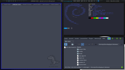](./img/qtile.png)

---

### 24.01.18/25.01.18
On Wednesday, after work I went to the same
[series of lectures](https://ot4os.imp.fu-berlin.de) that I've been to last
week. The topic this time was "Open Education and Digital Citizenship", though
it merely concentrated on changing today's education system to better suite
modern needs and society, as well as improving the handling of the educational
sector of new media-types. In comparison to last week's topic, this one was
obviously rather theoretical and philosophically. I still enjoyed it and the
lecture did have a stimulating effect on me to have a different point of view on
the matter. It's nothing to get overly excited about. It was more of a
thought experiment as well as a look into the far future.

Thursday started off with receiving an acceptance for the Master's Program I
applied for. So that was obviously quite big for me!

In the evening, I went to a FSFE-Fellowship meetup in Berlin. Because I was
really tired that day, I left after three hours already, however the meetup was
really nice and the people very helpful and friendly :)

---

### 26.01.18/27.01.18
As I said, the first half of the week has been fairly un-eventful.
Friday's where the real deal started!

A Friend of mine - Matthias - came to Berlin all the way from the Saarland to
visit me... That and because of the
[Architects](https://en.wikipedia.org/wiki/Architects_(British_band\))-Concert we
had tickets for. This has been the biggest of their events on european mainland
this tour. For two hours, they **wrecked this place**! I've been to two of their
concerts before, one in Luxembourg, one in Saarbrücken but of course the one in
Germany's capital was much, much bigger than that.
[While She Sleeps](https://en.wikipedia.org/wiki/While_She_Sleeps) supported
them, which is an excellent band as well. Down below are three pictures I took
myself, though you should also check out the ones their photographer took. They
look amazing!

[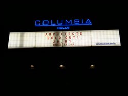](./img/architects_0.jpg) [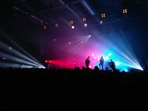](./img/architects_3.jpg) [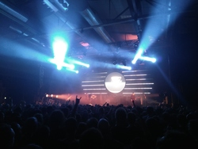](./img/architects_2.jpg) [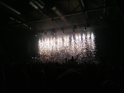](./img/architects_1.jpg)

[Images by Architects' photographer](https://twitter.com/Architectsuk/status/957033698573955074)

Saturday started late, as we had to recover. But we did have a lot of
sightseeing plans so it was a packed day. Of course we saw the
[TV-tower at Alexanderplatz](https://en.wikipedia.org/wiki/Fernsehturm_Berlin),
as well as the
[Berlin cathedral](https://en.wikipedia.org/wiki/Berlin_Cathedral),
[Humboldt University](https://en.wikipedia.org/wiki/Humboldt_University_of_Berlin),
the ["Neue Wache" (new guard house)](https://en.wikipedia.org/wiki/Neue_Wache),
["KaDeWe" (department store of the west)](https://en.wikipedia.org/wiki/Kaufhaus_des_Westens).
In the evening, we also went to the
[Brandenburg Gate](https://en.wikipedia.org/wiki/Brandenburg_Gate), the
[Reichstagsgebäude / Bundestag](https://en.wikipedia.org/wiki/Reichstag_building)
and the
["Siegessäule" (Victory Column)](https://en.wikipedia.org/wiki/Berlin_Victory_Column).

I haven't been quite hinest before. I did actually do some sightseeing in Berlin
already. Just not in 2018. I've been to Berlin for the first time in late
december last year, just for a couple of days. During that time, I saw and did
quite a lot, including a tour through the Bundestags-Building. So some of the
images below are from last december.

[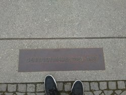](./img/berlin_1.jpg) [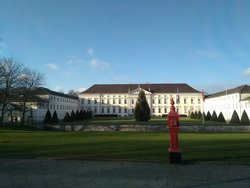](./img/berlin_2.jpg) [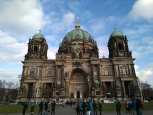](./img/berlin_3.jpg) [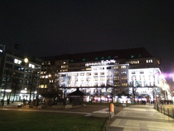](./img/berlin_6.jpg) [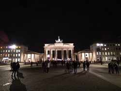](./img/berlin_7.jpg) [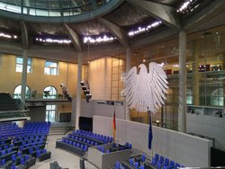](./img/berlin_9.jpg)

[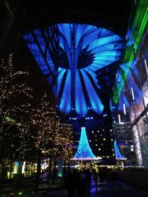](./img/berlin_4.jpg) [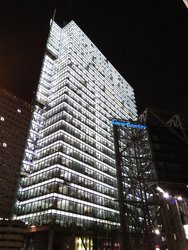](./img/berlin_5.jpg) [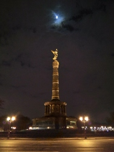](./img/berlin_8.jpg)

---

Sunday noon, Matthias left so there is nothing to tell there either...
Though not all weeks can be eventful and Friday as well as Saturday were indeed
amazing and extremely tiring. I suppose the coming week will start off easy
*again*, though I will travel to Brussels for [FOSDEM](https://fosdem.org/2018/)
on Saturday.

**Until then, Cheers!**
